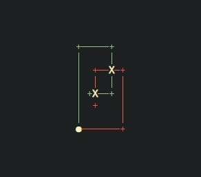
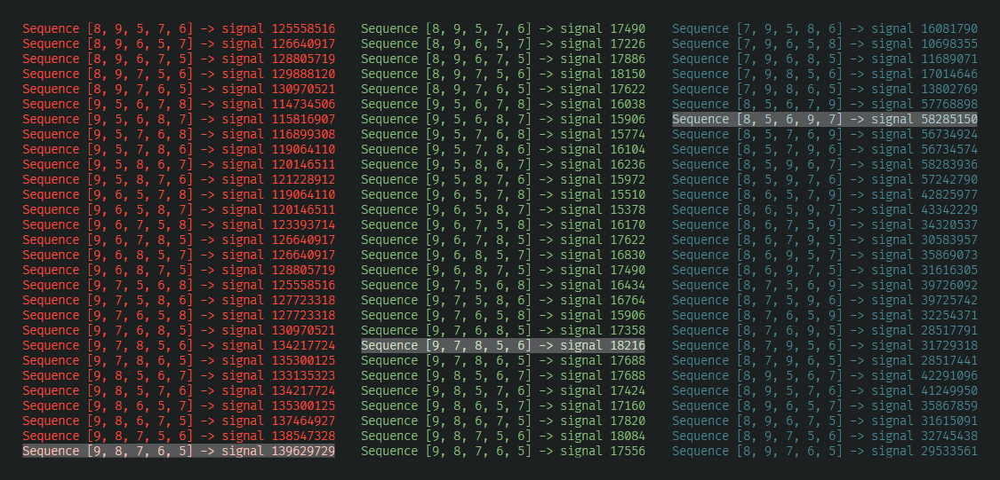
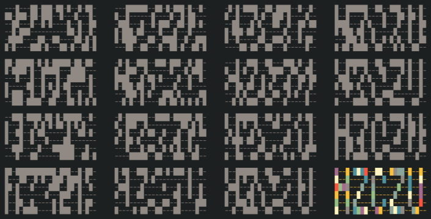
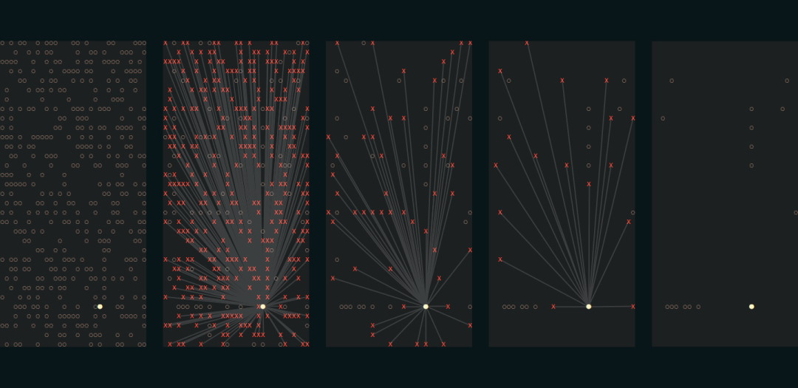
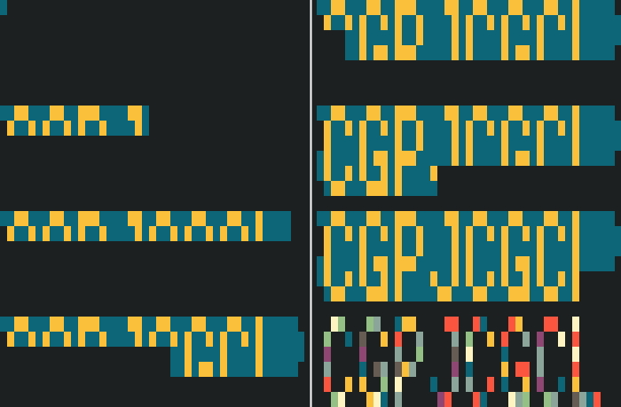

[:back: Back to events](https://github.com/vladmocanualexandru/advent_of_code)

# Advent of Code - 2019

## Prologue

Santa has become stranded at the edge of the Solar System while delivering presents to other planets! 
To accurately calculate his position in space, safely align his warp drive, 
and return to Earth in time to save Christmas, he needs you to bring him measurements from fifty stars.

Collect stars by solving puzzles. Two puzzles will be made available on each day in the Advent calendar; 
the second puzzle is unlocked when you complete the first. Each puzzle grants one star. 

Good luck!

## Days
| Mon | Tue | Wed | Thu | Fri | Sat | Sun |
| --- | --- | --- | --- | --- | --- | --- |
|||||||[01](./d01)|
|[02](./d02)|[03](./d03)|[04](./d04)|[05](./d05)|[06](./d06)|[07](./d07)|[08](./d08)|
|[09](./d09)|[10](./d10)|[11](./d11)|[12](./d12)|13|14|15|
|16|17|18|19|20|21|22|
|23|24|25|
||

## Epilogue

## Gallery

