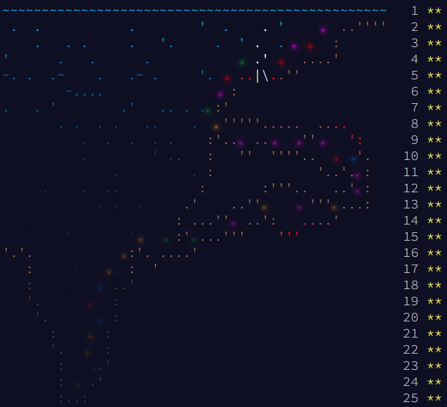
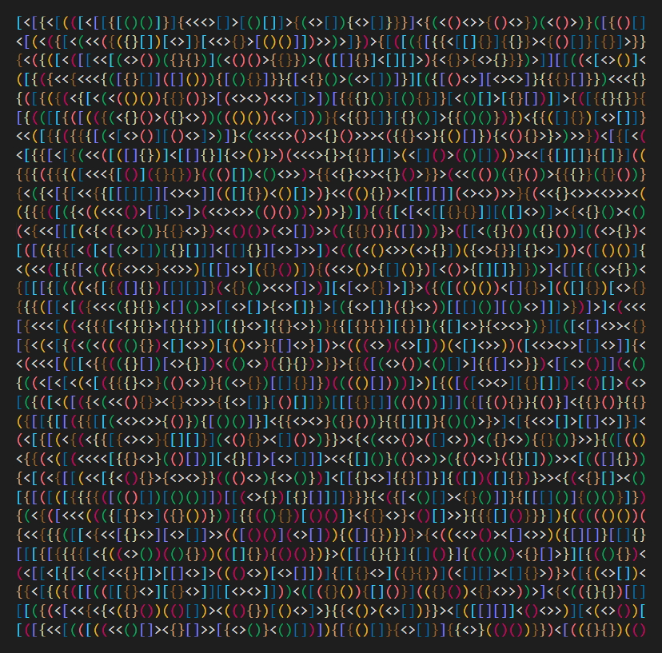
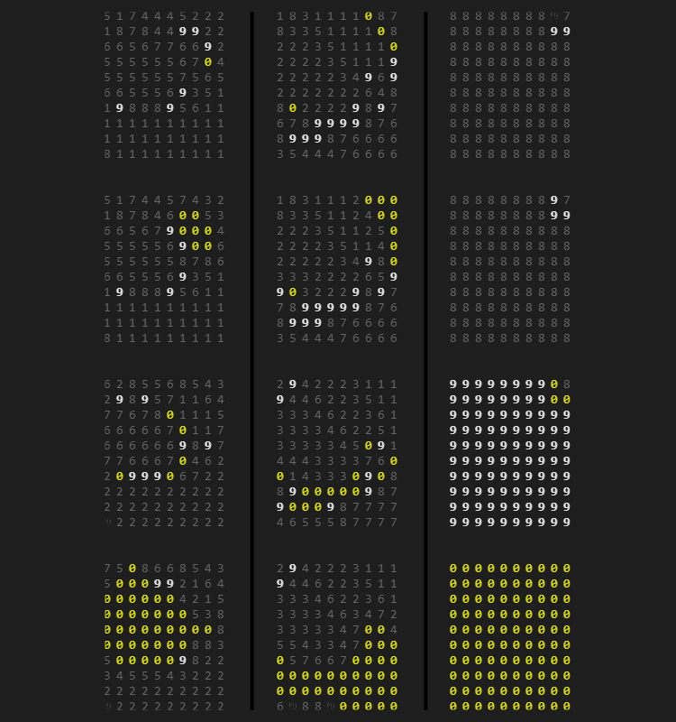
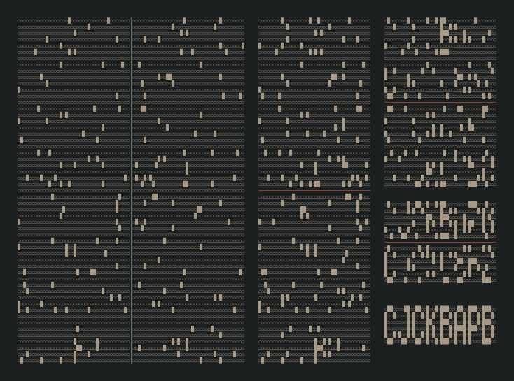
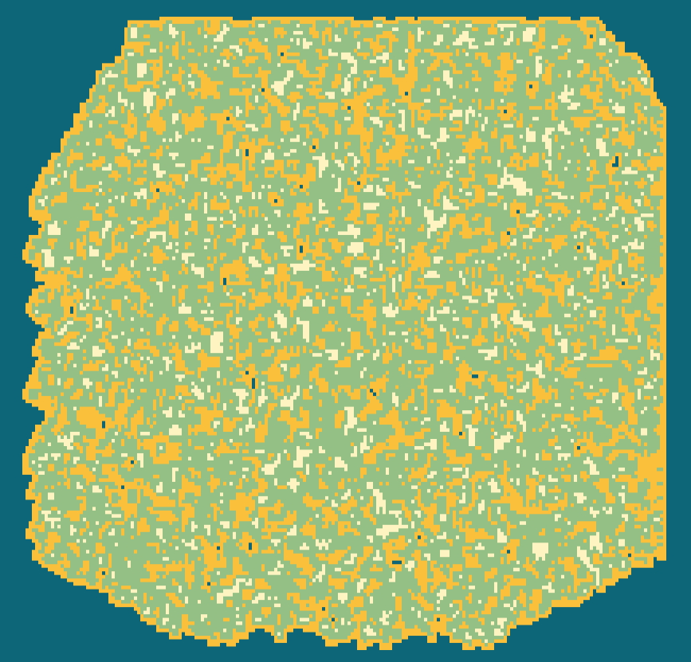

[:back: Back to events](https://github.com/vladmocanualexandru/advent_of_code)

# Advent of Code - 2021

## Prologue

You're minding your own business on a ship at sea when the overboard alarm goes off! You rush to see if you can help. Apparently, one of the Elves tripped and accidentally sent the sleigh keys flying into the ocean!

Before you know it, you're inside a submarine the Elves keep ready for situations like this. It's covered in Christmas lights (because of course it is), and it even has an experimental antenna that should be able to track the keys if you can boost its signal strength high enough; there's a little meter that indicates the antenna's signal strength by displaying 0-50 stars.

Your instincts tell you that in order to save Christmas, you'll need to get all fifty stars by December 25th.

Collect stars by solving puzzles. Two puzzles will be made available on each day in the Advent calendar; the second puzzle is unlocked when you complete the first. Each puzzle grants one star. 

Good luck!

## Days

| Mon | Tue | Wed | Thu | Fri | Sat | Sun |
| --- | --- | --- | --- | --- | --- | --- |
|||[01](./d01)|[02](./d02)|[03](./d03)|[04](./d04)|[05](./d05)|
|[06](./d06)|[07](./d07)|[08](./d08)|[09](./d09)|[10](./d10)|[11](./d11)|[12](./d12)|
|[13](./d13)|[14](./d14)|[15](./d15)|[16](./d16)|[17](./d17)|[18](./d18)|[19](./d19)|
|[20](./d20)|[21](./d21)|[22](./d22)|[23](./d23)|[24](./d24)|[25](./d25)|
||

## Epilogue

You use all fifty stars to boost the signal and remotely start the sleigh! Now, you just have to find your way back to the surface...

...did you know crab submarines come with colored lights?

Congratulations! 

You've finished every puzzle in Advent of Code 2021!

## Gallery

