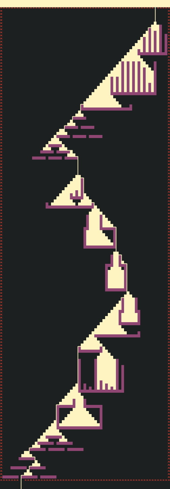

[:back: Back to events](https://github.com/vladmocanualexandru/advent_of_code)

# Advent of Code - 2022

## Prologue

Santa's reindeer typically eat regular reindeer food, but they need a lot of magical energy to deliver presents on Christmas. For that, their favorite snack is a special type of star fruit that only grows deep in the jungle. The Elves have brought you on their annual expedition to the grove where the fruit grows.

To supply enough magical energy, the expedition needs to retrieve a minimum of fifty stars by December 25th. Although the Elves assure you that the grove has plenty of fruit, you decide to grab any fruit you see along the way, just in case.

Collect stars by solving puzzles. Two puzzles will be made available on each day in the Advent calendar; the second puzzle is unlocked when you complete the first. Each puzzle grants one star. Good luck!

## Days

| Mon | Tue | Wed | Thu | Fri | Sat | Sun |
| --- | --- | --- | --- | --- | --- | --- |
||||[01](./d01)|[02](./d02)|[03](./d03)|[04](./d04)|
|[05](./d05)|[06](./d06)|[07](./d07)|[08](./d08)|[09](./d09)|[10](./d10)|[11](./d11)|
|[12](./d12)|[13](./d13)|[14](./d14)|15|16|17|18|
|19|20|21|22|23|24|25|
|| 

## Epilogue

## Gallery

